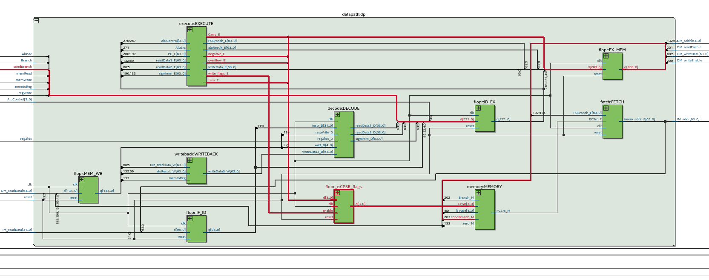
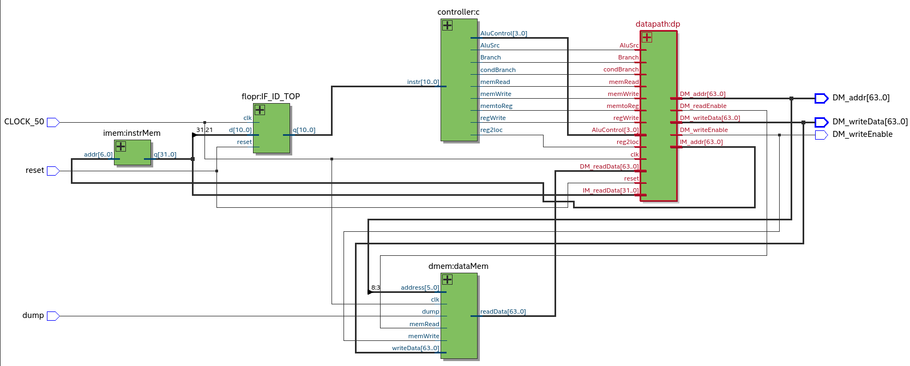

# Lab 1: ARMv8 en System Verilog #

## Integrantes ##

* Arrascaeta Labrador, Valentín.
* Bobbiesi Bender, Sofía Antonella.
* Tolcachir, Marcos.

## Ejercicio 2: Microprocesador con Pipeline ##

### Objetivos del ejercicio ###

Agregar la instucción `B.cond` y las 14 condiciones de salto, junto con las instrucciones aritméticas que configuran banderas del procesador. Las mismas son:

| Instrucción   | Nombre                                  |
|:--------------|:----------------------------------------|
|  `B.EQ`       | Branch on equal                         |
|  `B.NE`       | Branch on not equal                     |
|  `B.MI`       | Branch on minus                         |
|  `B.PL`       | Branch on plus                          |
|  `B.VS`       | Branch on overflow set                  |
|  `B.VC`       | Branch on overflow clear                |
|  `B.HI`       | Branch on greater than (unsigned)       |
|  `B.HS`       | Branch on greater than equal (unsigned) |
|  `B.LO`       | Branch on less than (unsigned)          |
|  `B.LS`       | Branch on less than equal (signed)      |
|  `B.GE`       | Branch on greater than equal (signed)   |
|  `B.GT`       | Branch on greater than (signed)         |
|  `B.LT`       | Branch on less than (signed)            |
|  `B.LE`       | Branch on less than equal (signed)      |
|  `ADDS`       | Add and set flags                       |
|  `SUBS`       | Sub and set flags                       |

Además, se debe agregar un nuevo bloque `bCondCheck` que verifique estas condiciones.

### Resolución ###

Se realizaron varias modificaciones en los módulos para la implementación de la consigna.

### Modificaciones ###

En primer lugar, se agregaron las flags de carry, overflow y negative (zero ya estaba implementada) en el módulo `alu.sv`. La asignación de las mismas depende del resultado calculado en la ALU, y se setean al final de cada operación en la misma.
Además, se agregó una señal más `write_flags` que se setea a 1 en caso de que se deban actualizar las flags (por ejemplo en ADDS y SUBS).
También se modificó la resta haciendo que ahora se sume el complemento_2.

Se añadieron las instucciones ADDS y SUBS al decodificador de control de la ALU, para que en caso de que sea alguna de estas instrucciones, se setee la señal `write_flags` mencionada anteriormente a 1.

En el módulo `execute.sv` se añadieron las nuevas flags y se hicieron las correspondientes conexiones con la ALU.

Se agregó un nuevo `flopr_e` al datapath que funciona como registro de las flags, cuya entrada está dada por la salida del módulo execute (Carry_E, negative_E, overflow_E y zero_E), y su salida es la entrada del módulo memory (CPSR).
En el módulo `memory.sv` (que representa la etapa memory del pipeline), se agregó toda la lógica de chequeo de condiciones de saltos correspondientes a las 14 condiciones planteadas en la consigna. Las mismas, setean la señal `bCondBranch` a su valor correspondiente verificando las flags (CPSR) seteadas por otras instrucciones.
Por ejemplo, si hacemos `ADDS X0, X0, X0` y luego `B.eq eq` se verificará que la flag zero esté en 1 y se tomará el salto.

En el módulo `signext.sv` se agregó la extensión de signo para la instrucción `B.cond`.

Por último, se realizaron las conexiones de la nuevas señal bCondBranch en los módulos `controller.sv`, `datapath.sv` y `maindec.sv`.

### Diagrama del procesador ###

El procesador modificado, se muestra a continuación:

Las nuevas señalos y módulos descritos anteriormente se muestran en color rojo.

### Código assembler ###

El siguiente código assembler chequea las condiciones de salto implementadas, mediante loops y branches.

~~~assembly
    STUR X6, [X20, #0]
    ADD XZR, XZR, XZR
    ADDS X0, X0, X0
    LDUR X15, [X20, #0]
    ADD XZR, XZR, XZR
    ADD XZR, XZR, XZR
    B.EQ eq
    ADD XZR, XZR, XZR
    ADD XZR, XZR, XZR
    ADD XZR, XZR, XZR
    CBZ XZR, fail
    ADD XZR, XZR, XZR
    ADD XZR, XZR, XZR
    ADD XZR, XZR, XZR

//Escribe 6 en la posición 0 de la memoria si B.EQ se realizó correctamente
eq:
    STUR X15, [X0, #0]
    ADDS X0, X0, X8
    B.NE ne
    ADD XZR, XZR, XZR
    ADD XZR, XZR, XZR
    ADD XZR, XZR, XZR
    CBZ XZR, fail
    ADD XZR, XZR, XZR
    ADD XZR, XZR, XZR
    ADD XZR, XZR, XZR

//Escribe 8 en la posición 1 de la memoria si B.NE se realizó correctamente
ne:
    STUR X0, [X0, #0]
    ADD X0, X0, X8

lo:    ADDS X30, X30, X30
    B.HS hs
    ADD XZR, XZR, XZR
    ADD XZR, XZR, XZR
    ADD XZR, XZR, XZR
    B.LO lo
    ADD XZR, XZR, XZR
    ADD XZR, XZR, XZR
    ADD XZR, XZR, XZR

//Escribe E000000000000000 en la posición 2 de la memoria si B.HS se realizó correctamente (y chequea B.LO en el loop mientras)
hs: 
    STUR X30, [X0, #0]
    SUBS X30, X30, X1
    ADD X0, X0, X8
    B.MI mi
    ADD XZR, XZR, XZR
    ADD XZR, XZR, XZR
    ADD XZR, XZR, XZR
    CBZ XZR, fail
    ADD XZR, XZR, XZR
    ADD XZR, XZR, XZR
    ADD XZR, XZR, XZR

//Escribe 18 en la posición 3 de la memoria si B.MI se realizó correctamente
mi:
    STUR X0, [X0, #0]
    ADDS X0, X0, X8
    B.PL pl
    ADD XZR, XZR, XZR
    ADD XZR, XZR, XZR
    ADD XZR, XZR, XZR
    CBZ XZR, fail
    ADD XZR, XZR, XZR
    ADD XZR, XZR, XZR
    ADD XZR, XZR, XZR

//Escribe 20 en la posición 4 de la memoria si B.PL se realizó correctamente
pl:
    STUR X0, [X0, #0]
    ADD X0, X0, X8

vc:    ADDS X30, X30, X30
    B.VS vs
    ADD XZR, XZR, XZR
    ADD XZR, XZR, XZR
    ADD XZR, XZR, XZR
    B.VC vc
    ADD XZR, XZR, XZR
    ADD XZR, XZR, XZR
    ADD XZR, XZR, XZR

//Escribe 7FFFFFFFFFFFFFFC en la posición 5 de la memoria si B.VS se realizó correctamente (y chequea B.VC en el loop mientras)
vs:
    STUR X30, [X0, #0]
    ADD X0, X0, X8

ls:    ADDS X30, X30, X30
    B.HI hi
    ADD XZR, XZR, XZR
    ADD XZR, XZR, XZR
    ADD XZR, XZR, XZR
    B.LS ls
    ADD XZR, XZR, XZR
    ADD XZR, XZR, XZR
    ADD XZR, XZR, XZR

//Escribe FFFFFFFFFFFFFFF0 en la posición 6 de la memoria si B.HI se realizó correctamente (y chequea B.LS en el loop mientras)

hi: 
    STUR X30, [X0, #0]
    ADDS X1, X1, X1
    B.GE ge
    ADD X0, X0, X8
    ADD XZR, XZR, XZR
    ADD XZR, XZR, XZR
    CBZ XZR, fail
    ADD XZR, XZR, XZR
    ADD XZR, XZR, XZR
    ADD XZR, XZR, XZR

//Escribe 38 en la posición 7 de la memoria si B.GE se realizó correctamente
ge:
    STUR X0, [X0, #0]
    SUBS X1, X1, X3
    B.LT lt
    ADD X0, X0, X8
    ADD XZR, XZR, XZR
    ADD XZR, XZR, XZR
    CBZ XZR, fail
    ADD XZR, XZR, XZR
    ADD XZR, XZR, XZR
    ADD XZR, XZR, XZR

//Escribe 40 en la posición 8 de la memoria si B.LT se realizó correctamente
lt:
    STUR X0, [X0, #0]
    ADDS X1, X1, X2
    B.GT gt
    ADD X0, X0, X8
    ADD XZR, XZR, XZR
    ADD XZR, XZR, XZR
    CBZ XZR, fail
    ADD XZR, XZR, XZR
    ADD XZR, XZR, XZR
    ADD XZR, XZR, XZR

//Escribe 48 en la posición 9 de la memoria si B.GT se realizó correctamente
gt:
    STUR X0, [X0, #0]
    SUBS X3, X3, X3
    B.le le
    ADD X0, X0, X8
    ADD XZR, XZR, XZR
    ADD XZR, XZR, XZR
    CBZ XZR, fail
    ADD XZR, XZR, XZR
    ADD XZR, XZR, XZR
    ADD XZR, XZR, XZR

//Escribe 50 en la posición 10 de la memoria si B.LE se realizó correctamente
le:
    STUR X0, [X0, #0]

fail:
    finlup: CBZ XZR, finlup

~~~

El output esperado es igual al que se muestra en la memoria al finalizar:

~~~text
Memoria RAM de Arm:
Address Data
0 0000000000000000
1 0000000000000008
2 E000000000000000
3 0000000000000018
4 0000000000000020
5 7FFFFFFFFFFFFFFC
6 FFFFFFFFFFFFFFF0
7 0000000000000038
8 0000000000000040
9 0000000000000048
10 0000000000000050
~~~
